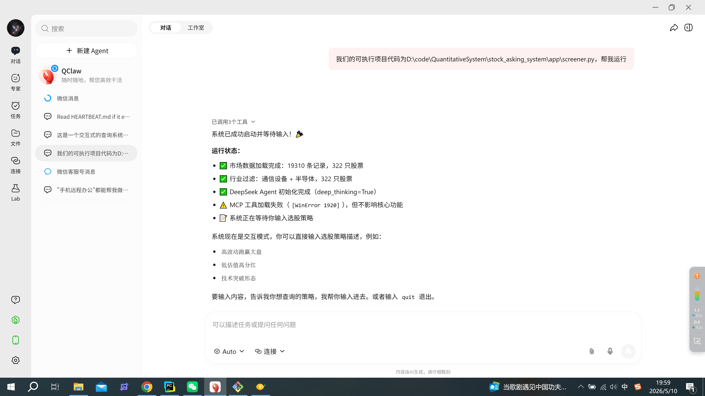
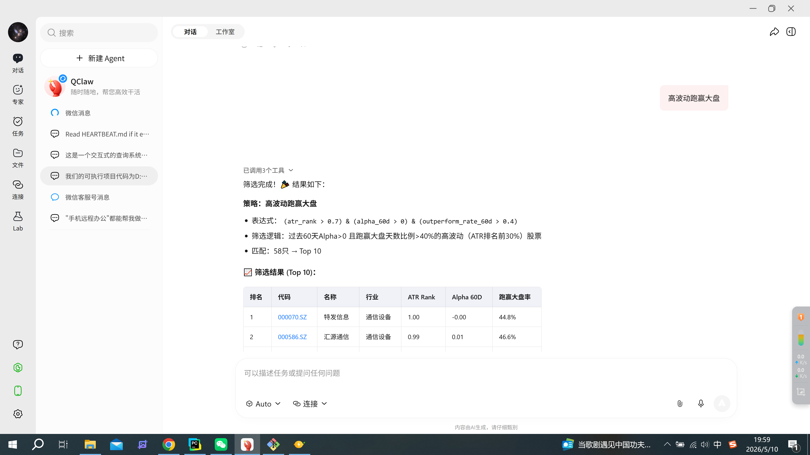
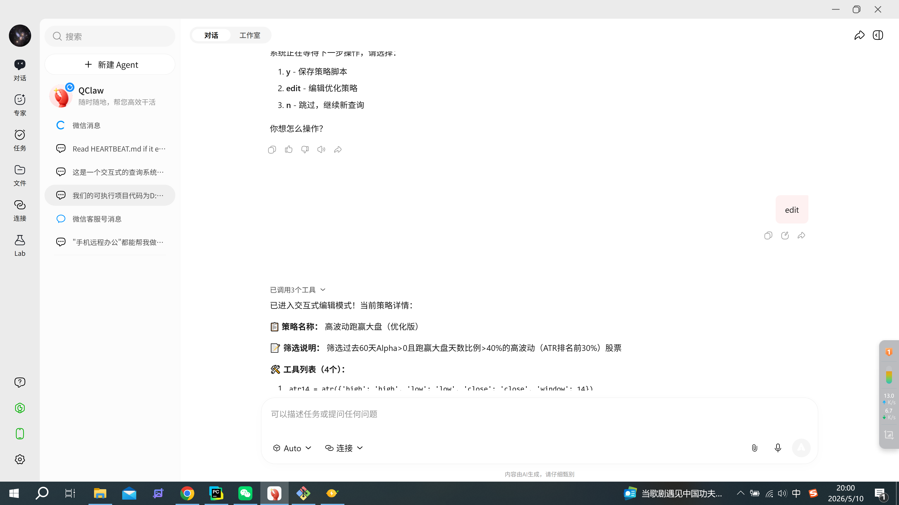
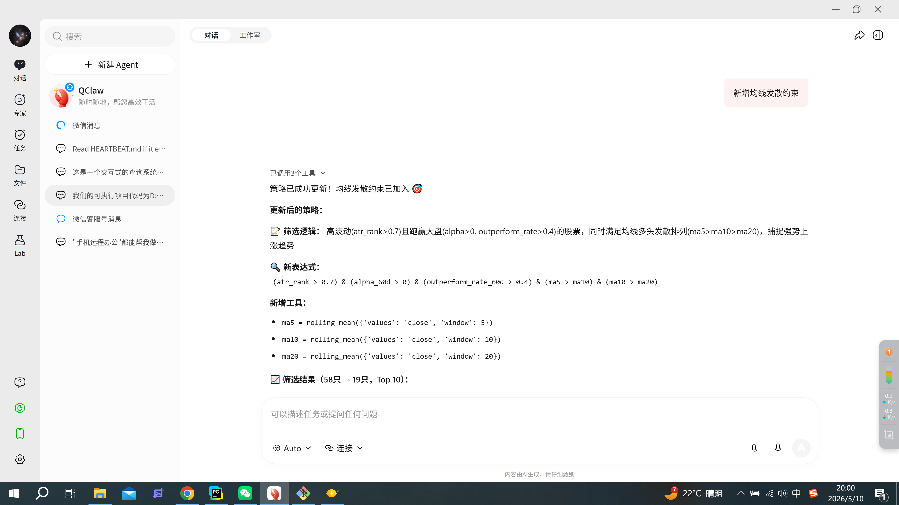

# AI驱动的交互式股票查询和策略生成系统

> AI驱动的交互式股票查询和策略生成系统

## 📖 项目简介

### 项目动机

在之前实现的量化系统 [QuantitativeSystem](https://github.com/luocheng812/QuantitativeSystem/tree/develop) 中，我们实现了因子挖掘系统和股票查询系统两大核心模块。

但考虑到对于个人投资者而言，因子挖掘几乎用不到。个人投资更看重短期的技术面的量价分析（本人实战亦是如此），因此我们对该框架进行升级，使其更加鲁棒和易维护。

**本项目：stock_asking_system**

💡 **项目定位**：面向个人投资者的实战工具，尤其适合短线技术派投资者


### 核心功能

- 🤖 **智能筛选** - 基于 LLM 理解自然语言，自动生成股票筛选策略，无需手动编写代码
- 💬 **交互式问答** - 支持多轮对话、增量修改、即时预览，精细化调整筛选条件（新增）
- 📊 **策略回测** - 对生成的策略进行历史回测，清晰展示收益情况，辅助投资决策

## 🏗️ 系统架构

```
Agent Layer (智能体层)
    ↓
Harness Framework (约束框架层)
    ↓
Tool Layer (工具层)
    ↓
Quality & Retry Layer (质量与重试层)
    ↓
Core Logic Layer (核心逻辑层)
    ↓
DataHub Layer (数据层)
    ↓
Infrastructure Layer (基础设施层)
```

### 分层架构图

```
┌─────────────────────────────────────────────────────────┐
│                    Agent Layer (智能体层)                  │
│  ┌──────────────┐  ┌──────────────┐  ┌──────────────┐  │
│  │ DeepAgents   │  │ LangGraph    │  │ MCP Client   │  │
│  │ (深度思考模式) │  │ (快速模式)    │  │ (工具调用)    │  │
│  └──────────────┘  └──────────────┘  └──────────────┘  │
│  ┌──────────────────────────────────────────────────┐  │
│  │         Interactive Editor (交互式问答) ⭐        │  │
│  │  • 多轮对话  • 增量修改  • 即时预览  • 版本控制   │  │
│  └──────────────────────────────────────────────────┘  │
└─────────────────────────────────────────────────────────┘
                           ↓
┌─────────────────────────────────────────────────────────┐
│              Harness Framework (约束框架层)               │
│  ┌──────────────┐  ┌──────────────┐  ┌──────────────┐  │
│  │ Hooks Engine │  │ Rules Loader │  │ Permissions  │  │
│  │ (钩子系统)    │  │ (规则引擎)    │  │ (权限控制)    │  │
│  └──────────────┘  └──────────────┘  └──────────────┘  │
│  • PreToolUse/PostToolUse/Stop 三阶段钩子                │
│  • Markdown规则注入 (.stock_asking/rules/)              │
│  • 白名单/黑名单通配符匹配                                │
└─────────────────────────────────────────────────────────┘
                           ↓
┌─────────────────────────────────────────────────────────┐
│                 Tool Layer (工具层)                       │
│  ┌──────────────────┐  ┌──────────────────────┐        │
│  │ Bridge Tools     │  │ MCP Server Tools     │        │
│  │ (本地Python函数)  │  │ (远程量化工具服务)     │        │
│  └──────────────────┘  └──────────────────────┘        │
└─────────────────────────────────────────────────────────┘
                           ↓
┌─────────────────────────────────────────────────────────┐
│          Quality & Retry Layer (质量与重试层)             │
│  ┌──────────────────┐  ┌──────────────────────┐        │
│  │ Quality Evaluator│  │ Smart Retry Manager  │        │
│  │ (质量评估器)      │  │ (智能重试管理器)      │        │
│  └──────────────────┘  └──────────────────────┘        │
│  • 多维度质量评分 (结果完整性/数量合理性/逻辑一致性)       │
│  • 错误类型识别 (参数验证/超时/无结果/配置错误等)         │
│  • 自适应参数调整 (自动优化筛选条件/放宽阈值)             │
│  • 持久化学习 (SQLite记录重试历史供Agent参考)            │
└─────────────────────────────────────────────────────────┘
                           ↓
┌─────────────────────────────────────────────────────────┐
│              Core Logic Layer (核心逻辑层)                 │
│  ┌──────────────┐  ┌──────────────┐  ┌──────────────┐  │
│  │ Screening    │  │ Backtest     │  │ Strategy     │  │
│  │ Engine       │  │ Engine       │  │ Generator    │  │
│  └──────────────┘  └──────────────┘  └──────────────┘  │
└─────────────────────────────────────────────────────────┘
                           ↓
┌─────────────────────────────────────────────────────────┐
│                DataHub Layer (数据层)                     │
│  ┌────────┐ ┌──────┐ ┌───────┐ ┌──────┐ ┌──────────┐  │
│  │ Stock  │ │ Fund │ │ Index │ │News  │ │ Feature  │  │
│  └────────┘ └──────┘ └───────┘ └──────┘ └──────────┘  │
│           Repository Pattern + Parquet Cache            │
└─────────────────────────────────────────────────────────┘
                           ↓
┌─────────────────────────────────────────────────────────┐
│             Infrastructure Layer (基础设施层)              │
│  Config / Logging / Session / Telemetry                 │
└─────────────────────────────────────────────────────────┘
```

## 🔄 工作流程

### 典型使用场景

#### 1. 策略挖掘（交互式）

```
   用户: "帮我找放量突破的股票"
   ↓
   初始化：加载原始市场数据（全量股票）
   ↓
   股票池过滤：独立服务模块执行过滤（ST/行业/价格/市值等）
   ↓
   Agent解析意图 → 生成筛选逻辑（基于过滤后的数据）
   ↓
   Screening Engine执行 → 返回候选股票
   ↓
   【交互环节】显示结果 + 提供优化建议
   ↓
   用户选择：
   ├─ 保存策略脚本 (y) → 自动生成Python脚本 → 保存到 screening_scripts/
   ├─ 编辑优化策略 (edit) → 进入交互式编辑模式 ⭐
   │   ├─ 修改表达式/参数/工具
   │   ├─ 自然语言微调（如"增加五日线约束"）
   │   ├─ 即时预览效果
   │   └─ 满意后保存或继续调整
   └─ 跳过，继续新查询 (n)
   ↓
   (可选) 触发回测验证
```

#### 2. 回测验证

```
   选择策略脚本目录
   ↓
   Backtest Engine加载历史数据
   ↓
   执行所有策略 → 计算多持有期收益
   ↓
   生成回测报告 (年化收益/胜率/持仓明细)
   ```


## 📝 交互式筛选与策略生成示例

### 🦞 小龙虾交互式问答

> QClaw调用系统，进行界面化股票筛选和策略优化
> 
> **注意**：微信链接小龙虾也可以查询，但感觉响应速度有点慢

|  |  |
|:---:|:---:|
|  |  |
---

### 💻 命令行交互式筛选

系统支持自然语言查询、自动策略生成以及精细化的交互式编辑：

```
[SYSTEM] 智能股票筛选系统 v2.0
📝 描述你的选股策略: 找出高波动且持续跑赢大盘的股票

📈 筛选结果详情 (Top 10):
| 排名 | 代码 | 名称 | 行业 | 综合评分 | Alpha 60 | Beta 60 | Outperform Rate 60 |
|:---:|:---|:---|:---|:---:|:---|:---|:---|
| 1 | 600487.SH | **亨通光电** | 通信设备 | **0.00** | 0.01 | 1.65 | 56.9% |
| 2 | 300604.SZ | **长川科技** | 半导体 | **0.00** | 0.01 | 1.36 | 50.0% |
| 3 | 300570.SZ | **太辰光** | 通信设备 | **0.00** | 0.01 | 1.57 | 46.6% |
| ... | ... | ... | ... | ... | ... | ... | ... |

请选择 [SAVE/EDIT/SKIP]: edit

🎨 进入交互式筛选条件编辑模式
📋 策略名称: 高波动持续跑赢大盘
🛠️  工具列表 (4 个): beta_60, alpha_60, outperform_rate_60, atr_14
[SEARCH] 筛选表达式: (beta_60 > 1.0) & (alpha_60 > 0) & (outperform_rate_60 >= 0.5)

[CONFIG] 编辑> expr (beta_60 > 1.0) & (alpha_60 > 0.01) & (outperform_rate_60 >= 0.5)
✅ 表达式已更新
🔄 自动执行预览...

[CONFIG] 编辑> 新增均线发散条件

🔄 调用完整 Agent 流程...
   📋 当前策略: 高波动持续跑赢大盘（严格版）
   🔍 构造增强查询：保留原有逻辑 + 新增均线发散条件

✅ Agent 执行完成 (27.7s)
   📊 新表达式: (beta_60 > 1.0) & (alpha_60 > 0.01) & (outperform_rate_60 >= 0.5) & (ma5 > ma10) & (ma10 > ma20)
   🛠️ 新增工具: rolling_mean (ma5, ma10, ma20)
   ✅ 筛选结果: 322只 → 12只匹配 → Top 10
   🏭 行业分布: 半导体(6只), 通信设备(4只)

[OK] 策略逻辑已成功根据自然语言指令更新
```


## 🚀 快速开始

### 环境准备

```bash
# 1. 安装依赖
uv sync

# 2. 配置环境变量（复制示例文件并修改）
cp .env.example .env
# 编辑 .env 文件，填入 Tushare API Key 等信息
```

### 运行股票筛选

```bash
# 交互式筛选模式
python app/screener.py
```

### 运行策略回测

```bash
# 回测模式
python app/backtest.py
```


## 🔧 核心模块

### 1. DataHub - 统一数据访问层

**职责**：提供标准化的金融数据访问接口，支持股票、基金、指数、新闻、特征等多维数据。

**核心组件**：
- **Repository Pattern**：统一的仓储模式，支持本地/远程数据源自动切换
- **Domain Entities**：`Stock`, `Fund`, `Index`, `News`, `Feature`, `Calendar`
- **Data Loaders**：`StockDataLoader`, `FactorDataLoader` 提供便捷的数据加载接口
- **Parquet Cache**：基于日期的高效缓存机制 (`data_cache/stock/daily/`)

### 2. Agent System - 智能体系统

**职责**：基于LLM的智能决策引擎，理解用户意图并生成可执行的量化策略。

#### 💬 交互式问答功能（新增）

**核心特性**：
- **自然语言微调**：在编辑模式下直接输入中文指令（如"增加五日线约束"），AI 自动调整策略逻辑
- **多轮对话**：支持连续追问和条件调整，无需重新输入完整查询
- **即时预览**：每次修改后立即执行并显示结果，快速迭代优化
- **等权综合排序**：移除旧的置信度指标，采用截面归一化后的等权求和算法进行公平排序
- **版本控制**：支持 undo/redo、快照保存/加载，管理多个策略版本

**技术实现**：详见 [交互式问答原理](INTERACTIVE_QA_PRINCIPLE.md)

**核心组件**：
- **Agent Factory**：根据配置创建不同模式的Agent
- **Interactive Editor**：交互式编辑器（`src/agent/interactive/`）
- **Skill Registry**：三层渐进式技能加载系统
- **Long-term Memory**：跨会话持久化 (SQLite)
- **Tool Provider**：统一管理MCP工具和本地Bridge工具
- **Harness Framework**：Hooks/Rules/Permissions约束框架
  - **Hooks Engine**：三阶段钩子 (PreToolUse/**PostToolUse**/Stop)
    - PreToolUse：工具调用前验证（如 validate-strategy.py）
    - **PostToolUse：工具调用后验证（如 validate-thresholds.py，自动检查阈值合理性）**
    - Stop：会话结束前质量门禁（如 quality-gate.py）
  - **Rules Loader**：Markdown规则动态注入到system prompt
    - `data-quality.md`：数据质量规则
    - `expression-design.md`：表达式设计规范
    - **`tool-value-ranges.md`：工具返回值范围指南（阈值验证依据）**
  - **Permissions**：基于fnmatch的工具白名单/黑名单
- **Quality & Retry System**：质量评估与智能重试
  - **Quality Evaluator**：多维度结果质量评分 + **参数错误自动检测**
  - **Smart Retry Manager**：错误分类+自适应参数调整
  - **Auto-fix Loop**：基于质量反馈的自动优化循环
  - **PostToolUse Hook**：**工具执行后阈值验证**（新增）
    - 动态加载 `.stock_asking/rules/tool-value-ranges.md`
    - 自动检查 expression 中的阈值是否在合理范围内
    - 防止常见错误：`outperform_rate > 30`、`rsi > 150` 等
    - **实时拦截**：工具调用后立即验证，阻止明显错误的参数
- **智能参数验证**：Pydantic 自动验证 + 智能纠错建议

### 3. Screening Engine - 股票筛选引擎

**职责**：高效执行股票筛选逻辑，支持动态指标计算和多条件过滤。

**处理流程**：
```
用户查询 → LLM解析 → 筛选逻辑配置 → 预筛选 → 批量计算 → Top-N排序
```

**核心组件**：
- **PreFilterEngine**：基于股票池规则快速过滤（ST、停牌、上市天数、行业等）
- **BatchCalculator**：向量化批量计算技术指标和自定义因子
- **IndustryMatcher**：行业模糊匹配引擎
- **ScriptSaver**：自动生成可复用的Python筛选脚本

### 4. Backtest Engine - 回测引擎

**职责**：对生成的策略进行历史回测，评估策略有效性。

**回测流程**：
```
加载历史数据 → 执行策略脚本 → 计算持有期收益 → 生成统计报告
```

**核心功能**：
- **多持有期回测**：支持同时测试多个持有周期 (默认: 4日/10日/20日)
- **收益计算**：年化收益率、胜率、最大回撤等关键指标
- **组合统计**：投资组合层面的聚合分析
- **可视化报告**：结构化回测结果展示

### 5. MCP Server - 模型上下文协议服务

**职责**：提供标准化的量化工具服务接口，支持远程调用。

**架构特点**：
- **FastMCP框架**：基于MCP协议的轻量级服务
- **自动注册**：通过装饰器自动发现和注册工具函数
- **传输协议**：支持stdio和SSE两种传输方式
- **工具分类**：数据查询、指标计算、策略执行等
- **智能参数验证**：Pydantic 自动验证 + 常见错误智能纠错建议

### 6. Infrastructure - 基础设施层

**配置管理**：
- **多层配置**：YAML文件 + 环境变量 + 默认值
- **热重载**：支持运行时重新加载配置
- **类型安全**：基于Pydantic的配置验证

**其他组件**：
- **Logging**：结构化日志记录
- **Session Management**：会话状态持久化
- **Telemetry**：OpenTelemetry集成（可选）

## 💻 技术栈

| 类别 | 技术选型 |
|------|----------|
| **AI框架** | deepagents, LangGraph, LangChain |
| **数据处理** | **Polars (v2.0)**, Pandas, NumPy, PyArrow |
| **数据源** | Tushare Pro |
| **通信协议** | MCP (Model Context Protocol) |
| **配置管理** | Pydantic, YAML, dotenv |
| **测试框架** | pytest, pytest-cov |
| **代码质量** | black, ruff, mypy |
| **包管理** | uv (Python包管理器) |


## 📁 目录结构

```
stock_asking_system/
├── src/                      # 核心业务逻辑
│   ├── agent/               # Agent智能体系统
│   │   ├── core/           # Agent工厂、编排器
│   │   ├── tools/          # Bridge工具提供者
│   │   ├── context/        # Skills、Prompts
│   │   ├── memory/         # 长短期记忆
│   │   ├── harness/        # 约束框架
│   │   │   ├── hooks.py    # Hooks执行器 (PreToolUse/PostToolUse/Stop)
│   │   │   ├── rules.py    # Rules加载器 (.md文件→system prompt)
│   │   │   └── permissions.py  # 权限检查器 (白名单/黑名单)
│   │   ├── quality/        # 质量与重试
│   │   │   ├── evaluator.py    # 质量评估器
│   │   │   └── retry_manager.py # 智能重试管理器
│   │   ├── models/         # 数据模型
│   │   │   └── screening_logic.py  # 筛选逻辑模型
│   │   ├── security/       # 安全管理
│   │   ├── services/       # 服务层
│   │   │   └── stock_pool_service.py  # 股票池过滤服务 ⭐
│   │   ├── execution/      # 执行层
│   │   │   └── state_manager.py     # 会话状态管理器
│   │   ├── initialization/ # 初始化模块（已精简）
│   │   │   ├── component_initializer.py  # 组件初始化器
│   │   │   └── services/   # 初始化服务
│   │   │       └── industry_matcher_service.py  # 行业匹配服务
│   │   ├── interactive/    # 交互式问答（新增）⭐
│   │   │   ├── editor.py          # 条件编辑器
│   │   │   ├── command_parser.py  # 命令解析器
│   │   │   └── mode_manager.py    # 会话管理器
│   │   └── generators/     # 代码生成器
│   ├── screening/          # 股票筛选引擎
│   │   ├── executor.py     # 筛选执行器 ScreeningExecutor
│   │   ├── expression_evaluator.py  # 表达式评估器 ExpressionEvaluator
│   │   ├── mcp_tool_runner.py       # MCP工具运行器 MCPToolRunner
│   │   ├── namespace_builder.py     # 命名空间构建器 NamespaceBuilder
│   │   ├── batch_calculator.py      # 批量计算器 BatchCalculator
│   │   ├── stock_pool_filter.py     # 股票池筛选器 StockPoolFilter
│   │   ├── industry_matcher.py      # 行业匹配器 IndustryMatcher
│   │   ├── script_saver.py          # 脚本保存器 ScriptSaver
│   │   └── result_display.py        # 结果显示工具 ResultDisplayer
│   └── backtest/           # 回测引擎
│       ├── engine.py       # 回测主引擎
│       ├── returns.py      # 收益计算器
│       ├── report.py       # 报告生成器
│       └── utils.py        # 工具函数
├── datahub/                 # 数据访问层
│   ├── domain/             # 领域实体 (Stock/Fund/Index等)
│   ├── core/               # 核心抽象 (Repository/Dataset)
│   └── loaders/            # 数据加载器
├── mcp_server/             # MCP服务
│   ├── server.py           # 服务入口
│   └── executors/          # 工具执行器
├── infrastructure/         # 基础设施
│   ├── config/            # 配置管理
│   ├── logging/           # 日志系统
│   └── session/           # 会话管理
├── app/                    # 应用入口
│   ├── screener.py        # 股票筛选主入口
│   ├── backtest.py        # 回测主入口
│   └── setting/           # 配置文件
├── data_cache/            # 数据缓存 (Parquet)
├── .stock_asking/         # Agent运行时配置
│   ├── hooks/            # Hook脚本目录
│   │   ├── validate-thresholds.py  # 阈值验证Hook（PostToolUse）
│   │   ├── tool-call-validator.py  # 工具调用验证Hook
│   │   └── quality-gate.py       # 质量门禁Hook（Stop）
│   ├── rules/            # 规则文件目录
│   │   ├── data-quality.md       # 数据质量规则
│   │   ├── expression-design.md  # 表达式设计规范
│   │   └── tool-value-ranges.md  # 工具返回值范围指南
│   └── skills/           # Agent技能库（按需加载）
│       ├── stock-screening/      # 股票筛选技能
│       ├── strategy-patterns/    # 策略模式参考
│       └── quality-assessment/   # 质量评估标准
│           └── SKILL.md          # 质量标准与重试策略
└── docs/                  # 文档
```


## ⚙️ Harness 约束框架

Harness 框架为 Agent 提供三层约束机制，确保执行过程安全可控：

### 1. Hooks 钩子系统

三阶段钩子拦截机制，在关键节点执行自定义验证逻辑：

- **PreToolUse**：工具调用前验证（如策略格式检查）
- **PostToolUse**：工具调用后验证
- **Stop**：结果返回前质量门禁

**Exit Code 协议**：

| Code | 含义 | 行为 |
|------|------|------|
| `0` | 通过 | 继续执行 |
| `1` | 警告 | 继续执行，记录警告 |
| `2` | 阻止 | 终止执行，错误信息返回给 Agent |

**配置示例**（`screening_interactive.yaml`）：

```yaml
harness:
  hooks:
    PreToolUse:
      - matcher: "run_screening"
        hooks:
          - type: command
            command: "python .stock_asking/hooks/validate-strategy.py"
    PostToolUse:
      - matcher: "run_screening"
        hooks:
          - type: command
            command: "python .stock_asking/hooks/validate-thresholds.py"
    Stop:
      - hooks:
          - type: command
            command: "python .stock_asking/hooks/quality-gate.py"
```

### 2. Rules 规则引擎

从 Markdown 文件加载业务规则并注入到 system prompt，约束 Agent 行为。

**规则文件位置**：`.stock_asking/rules/*.md`

**示例规则**：
- `data-quality.md`：数据质量规则（禁止未来函数等）

**加载流程**：
```
RulesLoader.load() 
  ↓
读取 .stock_asking/rules/*.md
  ↓
格式化为 system prompt 片段
  ↓
合并到 Agent 初始提示词
```

### 3. Permissions 权限控制

基于 fnmatch 通配符的工具白名单/黑名单机制。

```yaml
permissions:
  allow: ["*"]              # 允许所有工具
  deny: ["dangerous_tool_*"] # 禁止特定工具
```

> **优先级**：deny > allow

## 🛡️ 质量评估与智能重试

系统内置多维度质量评估和自动修复机制，确保输出结果可靠性。

### 1. Quality Evaluator (质量评估器)

对 Agent 输出进行多维度评分。

**评估维度**：
- **结果完整性**：是否包含必需字段
- **数量合理性**：筛选结果数量是否在合理范围
- **逻辑一致性**：筛选条件与用户需求是否匹配
- **数据有效性**：是否存在异常值或缺失

**输出示例**：

```
{
    "score": 0.85,
    "issues": ["结果数量过少"],
    "suggestions": ["放宽成交量阈值"],
    "should_retry": True
}
```

### 2. Smart Retry Manager (智能重试管理器)

基于错误类型识别的自适应重试机制。

**错误分类**：

| 类型 | 说明 | 是否可重试 |
|------|------|------------|
| **可重试错误** | 参数验证失败、超时、无结果、工具执行错误 | ✅ |
| **不可重试错误** | 配置错误、权限不足 | ❌ |

**自适应调整策略**：
- 参数验证失败 → 调整参数范围
- 无结果 → 放宽筛选条件（降低阈值、扩大时间窗口）
- 超时 → 减少数据量或简化计算

**持久化学习**：
- 重试记录存储到 SQLite (`memory.db`)
- Agent 可参考历史重试经验优化策略

### 3. Auto-fix Loop (自动修复循环)

当检测到质量问题时，系统自动触发优化循环。

**伪代码示例**：

```
result = agent.execute(query)
quality = quality_evaluator.evaluate(result)

if quality.should_retry:
    for attempt in range(max_retries):
        # 构建优化提示
        optimization_prompt = f"""
        原查询: {query}
        发现问题: {quality.issues}
        建议优化: {quality.suggestions}
        请调整筛选条件并重试
        """
        
        result = agent.execute(optimization_prompt)
        quality = quality_evaluator.evaluate(result)
        
        if not quality.should_retry:
            break
```

**实际效果**：
- ✅ 首次筛选结果为空 → 自动放宽条件重试
- ✅ 结果数量过多 → 自动增加过滤条件
- ✅ 逻辑不一致 → 重新生成筛选表达式


## 🔌 扩展开发

### 添加新的MCP工具

在 `mcp_server/executors/` 目录下创建工具文件，使用 `@register_tool` 装饰器自动注册。系统会自动识别工具依赖关系并进行拓扑排序。

### 添加新的筛选技能

在 `.stock_asking/skills/` 目录下创建技能目录和 `SKILL.md` 文件，定义特定的选股策略模板和使用指南。

### 工具调用拓扑结构

系统自动识别工具依赖关系并按正确顺序执行：

**依赖层级**：
1. **基础数据层**：`get_stock_data`, `rolling_mean`, `pct_change`
2. **技术指标层**：`rsi`, `macd`（依赖收盘价）
3. **指数相关层**：`beta`, `alpha`, `outperform_rate`（需股票+指数数据）
4. **高级指标层**：`zscore_normalize`, `rank_normalize`（依赖基础指标）

> Agent 自动处理依赖排序，无需手动指定执行顺序。

### 扩展数据源

实现 `DataSource` 接口并在 `datahub/source/` 中注册新的数据提供者。

## 📦 依赖要求

- **Python** >= 3.12
- **uv** (推荐包管理器)

**安装依赖**：

```
uv sync
```
## 🎯 版本更新

### v2.3 - 自然语言修改架构重构 (2026-05-10)

**核心改进**：
- 🔄 **复用完整 Agent 流程**：自然语言修改调用完整的 Harness + Hooks + 质量评估流程，而非简单 LLM 调用
- 📝 **上下文保持**：将当前策略作为上下文传递给 Agent，支持精准的增量修改
- ✅ **代码优化**：代码去重，提升性能

---

### v2.2 - 交互式问答系统 (2026-05-05)

**核心改进**：
- 💬 **多轮对话支持**：允许用户连续追问和条件调整，无需重新输入完整查询
- 🔧 **增量修改能力**：直接修改表达式、参数、工具，即时查看效果
- 👁️ **即时预览机制**：每次修改后立即执行并显示结果，快速迭代优化
- 📚 **版本控制系统**：支持 undo/redo、快照保存/加载，管理多个策略版本
- ⌨️ **命令驱动界面**：提供丰富的编辑命令（expr/param/add_tool/remove_tool等）

---

### v2.1 - Agent 架构优化与工具函数验证 (2026-04-22)

**核心改进**：
- 🎯 **Rules 与 Skills 职责分离**：将质量标准从强制规则移至参考指南，明确边界
- ⚡ **减少 System Prompt**：移除冗余的质量标准注入，降低 token 消耗
- ✅ **PostToolUse Hook 增强**：在 `run_screening` 工具执行后自动验证阈值合理性
- 🛡️ **防止 LLM 幻觉**：拦截明显错误的参数（如 `outperform_rate > 30`、`rsi > 150`）

---

### v2.0 - Polars 数据引擎与量化工具升级 (2026-04-19)

**核心改进**：
- ⚡ **Polars 全面替代 Pandas**：数据处理性能提升 3-4x，内存占用降低 60%
- 🔄 **零转换开销**：从数据加载到筛选全程使用 Polars DataFrame，Rust 后端加速
- 🎯 **简化 API**：废除 MultiIndex 强制要求，接口更简洁
- 📊 **指数分析工具集**：新增 Beta、Alpha、超额收益等 6 个专业 MCP 量化工具
- 🤖 **指数自动检测**：基于股票代码自动选择对应指数（科创板→科创50、创业板→创业板指等）
- 🎯 **质量评估重构**：从硬编码评分改为动态加载规则文件，Agent 自主决策

## 🙏 致谢

- **参考项目**：[QuantitativeSystem](https://github.com/luocheng812/QuantitativeSystem/tree/develop) - 感谢 luocheng812 对本框架的设计贡献
- **开源框架**：
  - [LangChain](https://python.langchain.com/) - 提供强大的 LLM 应用开发框架和 MCP 集成支持
- **数据服务**：
  - [Tushare](https://tushare.pro/document/2?doc_id=27)

## 📄 许可证

MIT License