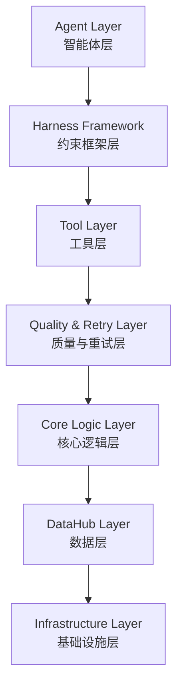

# AI驱动的量化交易系统

> 基于 LLM 的股票量价形态筛选和回测系统，**v2.0 采用 Polars 统一数据流，性能提升 3-4x**

## 📖 项目简介

### 项目动机

在之前实现的量化系统 [QuantitativeSystem](https://github.com/luocheng812/QuantitativeSystem/tree/develop) 中，我们实现了因子挖掘系统和股票查询系统两大核心模块。

但考虑到对于个人投资者而言，因子挖掘几乎用不到。个人投资更看重短期的技术面的量价分析（本人实战亦是如此），因此我们对该框架进行升级，使其更加鲁棒和易维护。

**本项目：stock_asking_system**

💡 **项目定位**：面向个人投资者的实战工具，尤其适合短线技术派投资者


### 核心功能

- 🤖 **智能筛选** - 基于 LLM 理解自然语言，自动生成股票筛选策略，无需手动编写代码
- 📊 **策略回测** - 对生成的策略进行历史回测，清晰展示收益情况，辅助投资决策

## 🏗️ 系统架构



### 分层架构图

```
┌─────────────────────────────────────────────────────────┐
│                    Agent Layer (智能体层)                  │
│  ┌──────────────┐  ┌──────────────┐  ┌──────────────┐  │
│  │ DeepAgents   │  │ LangGraph    │  │ MCP Client   │  │
│  │ (深度思考模式) │  │ (快速模式)    │  │ (工具调用)    │  │
│  └──────────────┘  └──────────────┘  └──────────────┘  │
└─────────────────────────────────────────────────────────┘
                           ↓
┌─────────────────────────────────────────────────────────┐
│              Harness Framework (约束框架层)               │
│  ┌──────────────┐  ┌──────────────┐  ┌──────────────┐  │
│  │ Hooks Engine │  │ Rules Loader │  │ Permissions  │  │
│  │ (钩子系统)    │  │ (规则引擎)    │  │ (权限控制)    │  │
│  └──────────────┘  └──────────────┘  └──────────────┘  │
│  • PreToolUse/PostToolUse/Stop 三阶段钩子                │
│  • Markdown规则注入 (.stock_asking/rules/)              │
│  • 白名单/黑名单通配符匹配                                │
└─────────────────────────────────────────────────────────┘
                           ↓
┌─────────────────────────────────────────────────────────┐
│                 Tool Layer (工具层)                       │
│  ┌──────────────────┐  ┌──────────────────────┐        │
│  │ Bridge Tools     │  │ MCP Server Tools     │        │
│  │ (本地Python函数)  │  │ (远程量化工具服务)     │        │
│  └──────────────────┘  └──────────────────────┘        │
└─────────────────────────────────────────────────────────┘
                           ↓
┌─────────────────────────────────────────────────────────┐
│          Quality & Retry Layer (质量与重试层)             │
│  ┌──────────────────┐  ┌──────────────────────┐        │
│  │ Quality Evaluator│  │ Smart Retry Manager  │        │
│  │ (质量评估器)      │  │ (智能重试管理器)      │        │
│  └──────────────────┘  └──────────────────────┘        │
│  • 多维度质量评分 (结果完整性/数量合理性/逻辑一致性)       │
│  • 错误类型识别 (参数验证/超时/无结果/配置错误等)         │
│  • 自适应参数调整 (自动优化筛选条件/放宽阈值)             │
│  • 持久化学习 (SQLite记录重试历史供Agent参考)            │
└─────────────────────────────────────────────────────────┘
                           ↓
┌─────────────────────────────────────────────────────────┐
│              Core Logic Layer (核心逻辑层)                 │
│  ┌──────────────┐  ┌──────────────┐  ┌──────────────┐  │
│  │ Screening    │  │ Backtest     │  │ Strategy     │  │
│  │ Engine       │  │ Engine       │  │ Generator    │  │
│  └──────────────┘  └──────────────┘  └──────────────┘  │
└─────────────────────────────────────────────────────────┘
                           ↓
┌─────────────────────────────────────────────────────────┐
│                DataHub Layer (数据层)                     │
│  ┌────────┐ ┌──────┐ ┌───────┐ ┌──────┐ ┌──────────┐  │
│  │ Stock  │ │ Fund │ │ Index │ │News  │ │ Feature  │  │
│  └────────┘ └──────┘ └───────┘ └──────┘ └──────────┘  │
│           Repository Pattern + Parquet Cache            │
└─────────────────────────────────────────────────────────┘
                           ↓
┌─────────────────────────────────────────────────────────┐
│             Infrastructure Layer (基础设施层)              │
│  Config / Logging / Session / Telemetry                 │
└─────────────────────────────────────────────────────────┘
```

## 🔧 核心模块

### 1. DataHub - 统一数据访问层

**职责**：提供标准化的金融数据访问接口，支持股票、基金、指数、新闻、特征等多维数据。

**核心组件**：
- **Repository Pattern**：统一的仓储模式，支持本地/远程数据源自动切换
- **Domain Entities**：`Stock`, `Fund`, `Index`, `News`, `Feature`, `Calendar`
- **Data Loaders**：`StockDataLoader`, `FactorDataLoader` 提供便捷的数据加载接口
- **Parquet Cache**：基于日期的高效缓存机制 (`data_cache/stock/daily/`)

### 2. Agent System - 智能体系统

**职责**：基于LLM的智能决策引擎，理解用户意图并生成可执行的量化策略。

#### 双模式架构

| 模式 | 配置 | 特点 | 适用场景 |
|------|------|------|----------|
| **Deep Thinking Mode** | `deep_thinking=true` | 使用 `deepagents` 框架，包含任务规划、Skills渐进加载、长期记忆 | 复杂策略挖掘场景 |
| **Quick Mode** | `deep_thinking=false` | 使用 LangGraph ReAct Agent，无任务规划，响应更快 | 简单查询场景 |

**核心组件**：
- **Agent Factory**：根据配置创建不同模式的Agent
- **Skill Registry**：三层渐进式技能加载系统
- **Long-term Memory**：跨会话持久化 (SQLite)
- **Tool Provider**：统一管理MCP工具和本地Bridge工具
- **Harness Framework**：Hooks/Rules/Permissions约束框架
  - **Hooks Engine**：三阶段钩子 (PreToolUse/PostToolUse/Stop)
  - **Rules Loader**：Markdown规则动态注入到system prompt（完整参数传递链）
  - **Permissions**：基于fnmatch的工具白名单/黑名单
- **Quality & Retry System**：质量评估与智能重试
  - **Quality Evaluator**：多维度结果质量评分 + **参数错误自动检测**
  - **Smart Retry Manager**：错误分类+自适应参数调整
  - **Auto-fix Loop**：基于质量反馈的自动优化循环
- **智能参数验证**：Pydantic 自动验证 + 智能纠错建议

### 3. Screening Engine - 股票筛选引擎

**职责**：高效执行股票筛选逻辑，支持动态指标计算和多条件过滤。

**处理流程**：
```
用户查询 → LLM解析 → 筛选逻辑配置 → 预筛选 → 批量计算 → Top-N排序
```

**核心组件**：
- **PreFilterEngine**：基于股票池规则快速过滤（ST、停牌、上市天数、行业等）
- **BatchCalculator**：向量化批量计算技术指标和自定义因子
- **IndustryMatcher**：行业模糊匹配引擎
- **ScriptSaver**：自动生成可复用的Python筛选脚本

### 4. Backtest Engine - 回测引擎

**职责**：对生成的策略进行历史回测，评估策略有效性。

**回测流程**：
```
加载历史数据 → 执行策略脚本 → 计算持有期收益 → 生成统计报告
```

**核心功能**：
- **多持有期回测**：支持同时测试多个持有周期 (默认: 4日/10日/20日)
- **收益计算**：年化收益率、胜率、最大回撤等关键指标
- **组合统计**：投资组合层面的聚合分析
- **可视化报告**：结构化回测结果展示

### 5. MCP Server - 模型上下文协议服务

**职责**：提供标准化的量化工具服务接口，支持远程调用。

**架构特点**：
- **FastMCP框架**：基于MCP协议的轻量级服务
- **自动注册**：通过装饰器自动发现和注册工具函数
- **传输协议**：支持stdio和SSE两种传输方式
- **工具分类**：数据查询、指标计算、策略执行等
- **智能参数验证**：Pydantic 自动验证 + 常见错误智能纠错建议

### 6. Infrastructure - 基础设施层

**配置管理**：
- **多层配置**：YAML文件 + 环境变量 + 默认值
- **热重载**：支持运行时重新加载配置
- **类型安全**：基于Pydantic的配置验证

**其他组件**：
- **Logging**：结构化日志记录
- **Session Management**：会话状态持久化
- **Telemetry**：OpenTelemetry集成（可选）

## 💻 技术栈

| 类别 | 技术选型 |
|------|----------|
| **AI框架** | deepagents, LangGraph, LangChain |
| **数据处理** | **Polars (v2.0)**, Pandas, NumPy, PyArrow |
| **数据源** | Tushare Pro |
| **通信协议** | MCP (Model Context Protocol) |
| **配置管理** | Pydantic, YAML, dotenv |
| **测试框架** | pytest, pytest-cov |
| **代码质量** | black, ruff, mypy |
| **包管理** | uv (Python包管理器) |


## 📁 目录结构

```
stock_asking_system/
├── src/                      # 核心业务逻辑
│   ├── agent/               # Agent智能体系统
│   │   ├── core/           # Agent工厂、编排器
│   │   ├── tools/          # Bridge工具提供者
│   │   ├── context/        # Skills、Prompts
│   │   ├── memory/         # 长短期记忆
│   │   ├── harness/        # 约束框架
│   │   │   ├── hooks.py    # Hooks执行器 (PreToolUse/PostToolUse/Stop)
│   │   │   ├── rules.py    # Rules加载器 (.md文件→system prompt)
│   │   │   └── permissions.py  # 权限检查器 (白名单/黑名单)
│   │   ├── quality/        # 质量与重试
│   │   │   ├── evaluator.py    # 质量评估器
│   │   │   └── retry_manager.py # 智能重试管理器
│   │   ├── models/         # 数据模型
│   │   │   └── screening_logic.py  # 筛选逻辑模型
│   │   ├── security/       # 安全管理
│   │   ├── services/       # 服务层
│   │   │   └── stock_pool_service.py  # 股票池服务
│   │   ├── execution/      # 执行层
│   │   ├── initialization/ # 初始化模块
│   │   └── generators/     # 代码生成器
│   ├── screening/          # 股票筛选引擎
│   │   ├── executor.py     # 筛选执行器 ScreeningExecutor
│   │   ├── prefilter.py    # 预筛选引擎 PreFilterEngine
│   │   ├── batch_calculator.py  # 批量计算器
│   │   ├── stock_pool_filter.py # 股票池筛选器 StockPoolFilter
│   │   ├── industry_matcher.py  # 行业匹配器
│   │   ├── script_saver.py      # 脚本保存器
│   │   ├── result_display.py    # 结果显示工具
│   │   └── tool_implementations.py  # 工具实现
│   └── backtest/           # 回测引擎
│       ├── engine.py       # 回测主引擎
│       ├── returns.py      # 收益计算器
│       ├── report.py       # 报告生成器
│       └── utils.py        # 工具函数
├── datahub/                 # 数据访问层
│   ├── domain/             # 领域实体 (Stock/Fund/Index等)
│   ├── core/               # 核心抽象 (Repository/Dataset)
│   └── loaders/            # 数据加载器
├── mcp_server/             # MCP服务
│   ├── server.py           # 服务入口
│   └── executors/          # 工具执行器
├── infrastructure/         # 基础设施
│   ├── config/            # 配置管理
│   ├── logging/           # 日志系统
│   └── session/           # 会话管理
├── app/                    # 应用入口
│   ├── screener.py        # 股票筛选主入口
│   ├── backtest.py        # 回测主入口
│   └── setting/           # 配置文件
├── data_cache/            # 数据缓存 (Parquet)
├── .stock_asking/         # Agent运行时配置
│   ├── hooks/            # Hook脚本目录
│   │   ├── validate-strategy.py  # 策略验证Hook
│   │   └── quality-gate.py       # 质量门禁Hook
│   ├── rules/            # 规则文件目录
│   │   ├── data-quality.md       # 数据质量规则
│   │   ├── expression-design.md  # 表达式设计规范
│   │   └── quality-criteria.md   # 质量评估标准
│   └── skills/           # Agent技能库（按需加载）
│       ├── stock-screening/      # 股票筛选技能
│       └── strategy-patterns/    # 策略模式参考
└── docs/                  # 文档
```

## 🔄 工作流程

### 典型使用场景

#### 1. 策略挖掘

```
   用户: "帮我找放量突破的股票"
   ↓
   初始化：加载原始市场数据（全量股票）
   ↓
   股票池过滤：独立服务模块执行过滤（ST/行业/价格/市值等）
   ↓
   Agent解析意图 → 生成筛选逻辑（基于过滤后的数据）
   ↓
   Screening Engine执行 → 返回候选股票
   ↓
   自动生成Python脚本 → 保存到 screening_scripts/
   ↓
   (可选) 触发回测验证
```

#### 2. 回测验证

```
   选择策略脚本目录
   ↓
   Backtest Engine加载历史数据
   ↓
   执行所有策略 → 计算多持有期收益
   ↓
   生成回测报告 (年化收益/胜率/持仓明细)
   ```

#### 3. 数据查询

```
   用户: “查询茅台最近30天的收盘价”
   ↓
   Agent调用MCP工具 → DataHub获取数据
   ↓
   格式化返回结果
   ```

## ⚙️ Harness 约束框架

Harness 框架为 Agent 提供三层约束机制，确保执行过程安全可控：

### 1. Hooks 钩子系统

三阶段钩子拦截机制，在关键节点执行自定义验证逻辑：

- **PreToolUse**：工具调用前验证（如策略格式检查）
- **PostToolUse**：工具调用后验证
- **Stop**：结果返回前质量门禁

**Exit Code 协议**：

| Code | 含义 | 行为 |
|------|------|------|
| `0` | 通过 | 继续执行 |
| `1` | 警告 | 继续执行，记录警告 |
| `2` | 阻止 | 终止执行，错误信息返回给 Agent |

**示例**：`.stock_asking/hooks/validate-strategy.py`

```python
# 验证策略输入参数
def validate_strategy(payload: dict) -> tuple[int, str]:
    tool_input = payload.get("tool_input", {})
    
    # 检查必需字段
    if "strategy_name" not in tool_input:
        return 2, "Missing required field: strategy_name"
    
    return 0, "Validation passed"
```

**配置方式** (`settings.yaml`)：

```yaml
harness:
  hooks:
    PreToolUse:
      - matcher: "run_screening"
        hooks:
          - type: command
            command: "python .stock_asking/hooks/validate-strategy.py"
    Stop:
      - hooks:
          - type: command
            command: "python .stock_asking/hooks/quality-gate.py"
```

### 2. Rules 规则引擎

从 Markdown 文件加载业务规则并注入到 system prompt，约束 Agent 行为。

**规则文件位置**：`.stock_asking/rules/*.md`

**示例规则**：
- `data-quality.md`：数据质量规则（禁止未来函数、停牌过滤等）

**加载流程**：
```
RulesLoader.load() 
  ↓
读取 .stock_asking/rules/*.md
  ↓
格式化为 system prompt 片段
  ↓
合并到 Agent 初始提示词
```

### 3. Permissions 权限控制

基于 fnmatch 通配符的工具白名单/黑名单机制。

```yaml
permissions:
  allow: ["*"]              # 允许所有工具
  deny: ["dangerous_tool_*"] # 禁止特定工具
```

> **优先级**：deny > allow

## 🛡️ 质量评估与智能重试

系统内置多维度质量评估和自动修复机制，确保输出结果可靠性。

### 1. Quality Evaluator (质量评估器)

对 Agent 输出进行多维度评分。

**评估维度**：
- **结果完整性**：是否包含必需字段
- **数量合理性**：筛选结果数量是否在合理范围
- **逻辑一致性**：筛选条件与用户需求是否匹配
- **数据有效性**：是否存在异常值或缺失

**输出示例**：

```python
{
    "score": 0.85,
    "issues": ["结果数量过少"],
    "suggestions": ["放宽成交量阈值"],
    "should_retry": True
}
```

### 2. Smart Retry Manager (智能重试管理器)

基于错误类型识别的自适应重试机制。

**错误分类**：

| 类型 | 说明 | 是否可重试 |
|------|------|------------|
| **可重试错误** | 参数验证失败、超时、无结果、工具执行错误 | ✅ |
| **不可重试错误** | 配置错误、权限不足 | ❌ |

**自适应调整策略**：
- 参数验证失败 → 调整参数范围
- 无结果 → 放宽筛选条件（降低阈值、扩大时间窗口）
- 超时 → 减少数据量或简化计算

**持久化学习**：
- 重试记录存储到 SQLite (`memory.db`)
- Agent 可参考历史重试经验优化策略

### 3. Auto-fix Loop (自动修复循环)

当检测到质量问题时，系统自动触发优化循环。

**伪代码示例**：

```python
result = agent.execute(query)
quality = quality_evaluator.evaluate(result)

if quality.should_retry:
    for attempt in range(max_retries):
        # 构建优化提示
        optimization_prompt = f"""
        原查询: {query}
        发现问题: {quality.issues}
        建议优化: {quality.suggestions}
        请调整筛选条件并重试
        """
        
        result = agent.execute(optimization_prompt)
        quality = quality_evaluator.evaluate(result)
        
        if not quality.should_retry:
            break
```

**实际效果**：
- ✅ 首次筛选结果为空 → 自动放宽条件重试
- ✅ 结果数量过多 → 自动增加过滤条件
- ✅ 逻辑不一致 → 重新生成筛选表达式


## 📝 策略脚本生成和股票推送示例

当用户通过自然语言查询股票时，系统会自动生成筛选策略、执行筛选并推送结果：

```
查询 1: 找出最近放量突破的股票：
1. 成交量较前期放大（至少 1.5 倍）
2. 涨幅>3%
3. 技术形态良好

============================================================
 创建新会话：session_20260414_002605

 StockScreener 使用预筛选股票池：4769 只股票

    步骤 1: 计算技术指标并筛选 (第 1 次迭代)...

       筛选逻辑:
         表达式：(vol > vol_ma20 * 1.5) & (pct_1d > 0.03) & (close > ma5) & (close > ma10) & (close > ma20) & (close >= high_20 * 0.95)
         置信度：rank_normalize(vol / vol_ma20) * 0.4 + rank_normalize(pct_1d) * 0.3 + rank_normalize((close - ma20) / ma20) * 0.3
         工具步骤:
            vol_ma20 = rolling_mean({'column': 'vol', 'window': 20})
            vol_ma5 = rolling_mean({'column': 'vol', 'window': 5})
            pct_1d = pct_change({'column': 'close', 'periods': 1})
            ma5 = rolling_mean({'column': 'close', 'window': 5})
            ma10 = rolling_mean({'column': 'close', 'window': 10})
            ma20 = rolling_mean({'column': 'close', 'window': 20})
            high_20 = rolling_max({'column': 'high', 'window': 20})
            low_20 = rolling_min({'column': 'low', 'window': 20})

       向量化批量筛选模式 (4769 只股票)
      数据过滤：4769  4765 只有效股票
         无最新数据：4 只
       执行 8 个主工具...
         [1/8]  rolling_mean  vol_ma20
         [2/8]  rolling_mean  vol_ma5
         [3/8]  pct_change  pct_1d
         [4/8]  rolling_mean  ma5
         [5/8]  rolling_mean  ma10
         [6/8]  rolling_mean  ma20
         [7/8]  rolling_max  high_20
         [8/8]  rolling_min  low_20
       工具执行完成，成功：8, 失败：0

       筛选统计:
         候选股票数：4769
         无最新数据：4 只
         表达式为 False: 4703 只
          成功匹配：62 只
         ️ 耗时：0.66s
       成功筛选：62 只

 查询完成 (53209ms)

 Agent 分析结果:
------------------------------------------------------------
很好！我为您筛选出了20只符合放量突破条件的股票。以下是筛选结果的详细分析：

##  筛选结果概览
成功筛选出 **20只** 符合放量突破条件的股票，候选数量适中，质量良好。

##  筛选条件详解
1. **成交量放大**：成交量较20日均量放大1.5倍以上
2. **涨幅要求**：当日涨幅超过3%
3. **技术形态**：
   - 收盘价站上5日、10日、20日均线（多头排列）
   - 收盘价接近20日最高价（达到95%以上），显示强势突破形态

##  前5名股票详情

### 1. 东山精密 (002384.SZ)
- **行业**：元器件
- **关键指标**：
  - 成交量：108.6万手，是20日均量的4.8倍
  - 涨幅：14.23%
  - 收盘价：146.83元，接近20日最高价149.68元
  - 均线排列：多头排列良好

### 2. 阳光电源 (300274.SZ)
- **行业**：电气设备
- **关键指标**：
  - 成交量：85.1万手，是20日均量的3.3倍
  - 涨幅：15.76%
  - 收盘价：134.24元，接近20日最高价136.31元

### 3. 亿纬锂能 (300014.SZ)
- **行业**：电气设备
- **关键指标**：
  - 成交量：85.5万手，是20日均量的4.0倍
  - 涨幅：17.38%
  - 收盘价：70.02元，接近20日最高价71.85元

### 4. 中科曙光 (603019.SH)
- **行业**：IT设备
- **关键指标**：
  - 成交量：70.1万手，是20日均量的3.7倍
  - 涨幅：11.14%
  - 收盘价：88.99元，接近20日最高价90.5元

### 5. 太辰光 (300570.SZ)
- **行业**：通信设备

  - ...
       策略脚本已保存：screening_scripts\放量突破/放量突破_20260414_002658.py
```

## 📊 回测示例

执行回测后，系统会输出详细的筛选过程和回测报告：

```
执行策略：放量突破_20260413_235007.py

    步骤 1: 计算技术指标并筛选 (第 1 次迭代)...

       筛选逻辑:
         表达式：(vol > vol_ma5 * 1.2) & (pct_1d > 0.02) & (close > ma5)
         置信度：rank_normalize(vol / vol_ma5) * 0.5 + rank_normalize(pct_1d) * 0.3 + rank_normalize(close / ma5) * 0.2
         工具步骤:
            vol_ma5 = rolling_mean({'column': 'vol', 'window': 5})
            ma5 = rolling_mean({'column': 'close', 'window': 5})
            pct_1d = pct_change({'column': 'close', 'periods': 1})

       向量化批量筛选模式 (5232 只股票)
      数据过滤：5232  5219 只有效股票
         无最新数据：13 只
       执行 3 个主工具...
         [1/3]  rolling_mean  vol_ma5
         [2/3]  rolling_mean  ma5
         [3/3]  pct_change  pct_1d
       工具执行完成，成功：3, 失败：0

       筛选统计:
         候选股票数：5232
         无最新数据：13 只
         表达式为 False: 4764 只
          成功匹配：455 只
         ️ 耗时：1.02s
       成功筛选：455 只

回测报告详情 - 持仓股票及收益
====================================================================================================

【放量突破_20260413_235007】

前 20 大持仓股票：
股票名称  行业    10日收益率   20日收益率   5日收益率    
---------------------------------------
英维克   专用机械      5.75%   -9.34%   -6.82%
澜起科技  半导体      -9.49%  -18.52%  -10.07%
盐湖股份  农药化肥      2.68%   17.02%   -1.16%
华友钴业  小金属       0.69%   -6.68%   -2.15%
德明利   半导体      -8.28%    3.02%  -14.30%
航天发展  通信设备     -1.33%   12.71%    6.57%
数据港   软件服务     13.92%    1.22%    4.23%
润泽科技  软件服务     17.92%     N/A     6.07%
招商银行  银行        0.10%    0.31%    2.40%
联特科技  通信设备    -17.09%   13.83%  -14.73%
湖南黄金  黄金      -12.16%   -0.03%   -2.81%
中科曙光  IT设备      2.15%   -3.52%   -3.32%
北方稀土  小金属       6.11%    4.44%   -2.87%
长芯博创  通信设备     -3.40%  -12.49%   -5.12%
科大讯飞  软件服务     -4.16%  -10.23%   -8.04%
昆仑万维  互联网       8.23%   -1.40%   -1.79%
宏景科技  软件服务    -12.26%    2.15%  -19.49%
江波龙   半导体      -9.62%   -1.75%  -14.29%
云铝股份  铝       -10.23%   -0.12%   -5.77%
航天科技  汽车配件     -8.08%  -12.30%   -4.93%

持仓统计：
+------+--------+----------+----------+----------+--------+
| 持有期  |  有效样本  |   平均收益   |   最大收益   |   最大亏损   |   胜率   |
+------+--------+----------+----------+----------+--------+
|  5日  |  20只   |  -4.92%  |  +6.57%  | -19.49%  | 20.0%  |
| 10日  |  20只   |  -1.93%  | +17.92%  | -17.09%  | 45.0%  |
| 20日  |  19只   |  -1.14%  | +17.02%  | -18.52%  | 42.1%  |
+------+--------+----------+----------+----------+--------+

====================================================================================================
 回测完成！
```

## ⚙️ 配置说明

主要配置文件位于 `app/setting/` 目录。

**配置文件说明**：
- `screening.yaml` - LLM 配置、Harness 约束框架、权限控制等高级设置
- `stock_pool.yaml` - 股票池过滤条件（上市天数、ST 排除、行业、价格、市值、成交量等）
- `backtest.yaml` - 回测参数（持有期列表、筛选日期）

```yaml
llm:
  model: "deepseek-chat"
  api_key: "${DEFAULT_API_KEY}"
  temperature: 0.7

data:
  cache_root: "./data_cache"
  source_token: "${DATA_SOURCE_TOKEN}"

backtest:
  holding_periods: [5, 10, 20]      # 持有期列表（天）
  screening_date: "20260201"        # 回测筛选日期

stock_pool:
  min_list_days: 180                # 最小上市天数
  exclude_st: true                  # 排除 ST 股票
  exclude_suspended: true           # 排除停牌股票
  industry: null                    # 行业过滤列表（null=全市场）
  min_price: 0.0                    # 最低价格（0=不过滤）
  max_price: 999999                 # 最高价格
  min_total_mv: 0.0                 # 最小总市值（万元，0=不过滤）
  max_total_mv: 999999999           # 最大总市值（万元）

harness:
  max_iterations: 3                 # Agent 最大迭代次数
  deep_thinking: false              # 是否启用深度思考模式
```

> **环境变量管理**：通过 `.env` 文件配置敏感信息（参考 `.env.example`）

## 🔌 扩展开发

### 添加新的MCP工具

在 `mcp_server/executors/` 目录下创建工具文件，使用 `@register_tool` 装饰器自动注册。系统会自动识别工具依赖关系并进行拓扑排序。

### 添加新的筛选技能

在 `.stock_asking/skills/` 目录下创建技能目录和 `SKILL.md` 文件，定义特定的选股策略模板和使用指南。

### 工具调用拓扑结构

系统自动识别工具依赖关系并按正确顺序执行：

**依赖层级**：
1. **基础数据层**：`get_stock_data`, `rolling_mean`, `pct_change`
2. **技术指标层**：`rsi`, `macd`（依赖收盘价）
3. **指数相关层**：`beta`, `alpha`, `outperform_rate`（需股票+指数数据）
4. **高级指标层**：`zscore_normalize`, `rank_normalize`（依赖基础指标）

> Agent 自动处理依赖排序，无需手动指定执行顺序。

### 扩展数据源

实现 `DataSource` 接口并在 `datahub/source/` 中注册新的数据提供者。

## 📦 依赖要求

- **Python** >= 3.12
- **uv** (推荐包管理器)

**安装依赖**：

```bash
uv sync
```
## 🎯 版本更新

### v2.0 - Polars 数据引擎与量化工具升级 (2026-04-19)

**数据引擎升级**：
- ⚡ **Polars 全面替代 Pandas**：数据处理性能提升 3-4x，内存占用降低 60%
- 🔄 **零转换开销**：从数据加载到筛选全程使用 Polars DataFrame，Rust 后端加速
- 🎯 **简化 API**：废除 MultiIndex 强制要求，接口更简洁

**新增量化工具**：
- 📊 **指数分析工具集**：新增 Beta、Alpha、超额收益、跟踪误差、信息比率、相关性等 6 个专业 MCP 量化工具
- 🤖 **指数自动检测**：移除手动配置 `index_code`，基于股票代码自动选择对应指数（科创板→科创50、创业板→创业板指等）

**架构优化**：
- 🎯 **质量评估重构**：从硬编码评分改为动态加载 `.stock_asking/rules/quality-criteria.md`，Agent 自主决策
- 📁 **配置结构优化**：Rules/Skills 目录重组，消除重复，职责清晰
- 🔄 **数据共享机制**：多个策略查询共享同一份过滤后的数据，避免重复加载
- 🎯 **职责分离**：股票池过滤由独立的 `StockPoolService` 模块处理（位于 `src/agent/services/`），Orchestrator 只负责流程编排

## 🙏 致谢

- **参考项目**：[QuantitativeSystem](https://github.com/luocheng812/QuantitativeSystem/tree/develop) - 感谢 luocheng812 对本框架的设计贡献
- **开源框架**：
  - [LangChain](https://python.langchain.com/) - 提供强大的 LLM 应用开发框架和 MCP 集成支持
- **数据服务**：
  - [Tushare](https://tushare.pro/document/2?doc_id=27)

## 📄 许可证

MIT License

